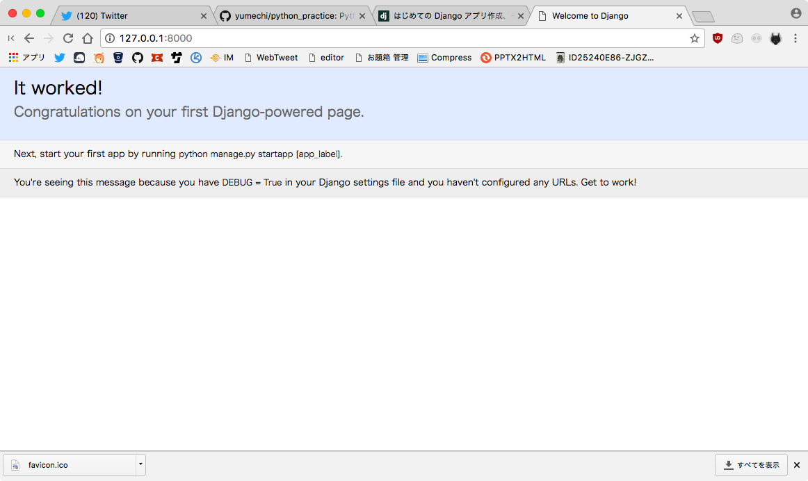

# Django tutorialをやってみる
## 参照先

公式のもの

https://docs.djangoproject.com/ja/1.11/intro/tutorial01/

## インストール
`pip install Django` で終わり。古いバージョンが入っている場合は、別途アンインストールが必要。

環境を壊す可能性があるので、pyenvとかvirtual−envとか使うと良さそう。
（私はいつもpyenvでやっている）
→ なのでanaconda3-4.4.0を入れた。

フレームワークとか新しいものを入れるときはsystemのpythonをいじらないのは共通の認識。

## プロジェクトを作る
`django-admin startproject mysite` を実行すると、mysiteって言うディレクトリが出来る。

### 疑問点のメモ
- [x] `django-admin` ってなにをするコマンドなんですか…
- projectsとかにまとめておいたので、疑問を解決したい → 一応解決した
- `django` ってコマンドがなくて、`django-admin` ってコマンドで操作する
- フォルダとかのtemplateが読み込まれるのは、`startproject` の領分みたい

### やってはいけないこと
- 組み込みとかDjangoのコンポーネントとかぶるような名前
- Webサーバーのドキュメントルート配下にコードを置かない（コードが読み取られてしまうため）

### startproject配下に出来るもの
公式サイトに書いてあるとおり。

- manege.py : プロジェクトに対して操作するためのコマンドラインユーティリティ
- 中に出来ている mysite/ : Pythonパッケージ。importの際に利用
- mysite/settings.py : Djangoプロジェクトの設定ファイル
- mysite/urls.py : URL宣言。
- mysite/wsgi.py : wsgiと使う時にいるらしい。私はそもそもwsgiをしらない。。。

### 開発用サーバーを立ち上げる
nodeとかphpみたいに簡易サーバーを立ち上げるコマンドがある。

`python manage.py runserver`

寄り道：faviconを表示してみたい。

